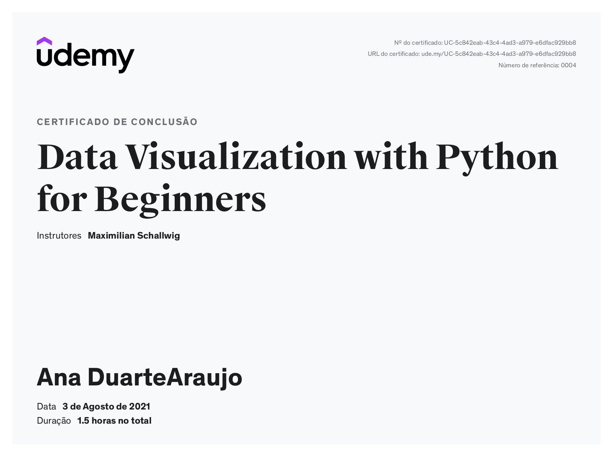

# Data Visualization with Python for Beginners

Códigos utilizado no curso de *Data Visualization with Python for Beginners* ministrado por Maximilian Schallwig

### Sobre o curso

🇧🇷

Dados e análises estão se tornando cada vez mais importantes em nosso mundo e no dia-a-dia dos negócios modernos. Para começar com a análise de dados (e, finalmente, fornecer boas imagens de nossos resultados), precisamos ser capazes de plotar nossos dados, de preferência da maneira que imaginamos em nossas cabeças.

Matplotlib fornece muitas oportunidades e métodos excelentes de *plotagem* para visualização de dados e, neste curso, veremos alguns métodos introdutórios para começar a criar gráficos em Python.

Assim que tivermos um ponto de partida para plotar os dados, podemos facilmente expandir nosso conhecimento para diferentes áreas para garantir que possamos representar melhor todos os nossos dados.

🇺🇸

Data and analytics are becoming increasingly important in our world and in modern day businesses. To start off with data analytics (and ultimately provide nice images of our results), we need to be able to plot our data, preferably in the way we imagine it in our heads.

Matplotlib provides many great plotting opportunities and methods for data visualization, and in this course we will be looking at some introductory methods for getting started with creating plots in Python.

Once we have a starting point for plotting data we can easily expand our knowledge to different areas to make sure we can best represent all of our data.

### Opinião

Curso curto e introdutório apresentando algumas funções do matplotlib no Python, acredito que os gráficos foram construídos com a finalidade de explorar as customizações oferecidas pela biblioteca, já a parte de análise dos gráficos e senso estético foram deixadas de lado. De toda forma, inserir setas com o <code>arrowprops</code> e conhecer outras possibilidades de escalas com o <code>plt.xscale</code> eram desconhecidos por mim até então.

### Certificado

